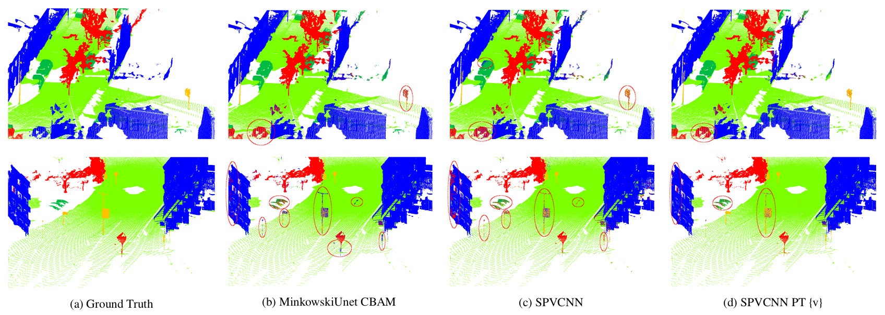

# 3D Semantic Segmentation
This is an implementation of 3D Semantic Segmentation project done towards completion of INT345 - Computer Vision.

# Notebook Links
1. [Presentation Notebook] (https://www.kaggle.com/tusharvilekar/3d-semantic-segmentation-presentation)
2. [Training Notebook] (https://www.kaggle.com/tusharvilekar/3d-semantic-segmentation-training-instance)

## References

1. https://doi.org/10.1016/j.cag.2022.06.010
2. https://github.com/grgzam/Attention_Mechanisms_for_3D_Semantic_Segmentation
3. https://github.com/POSTECH-CVLab/point-transformer
4. https://github.com/mit-han-lab/torchsparse